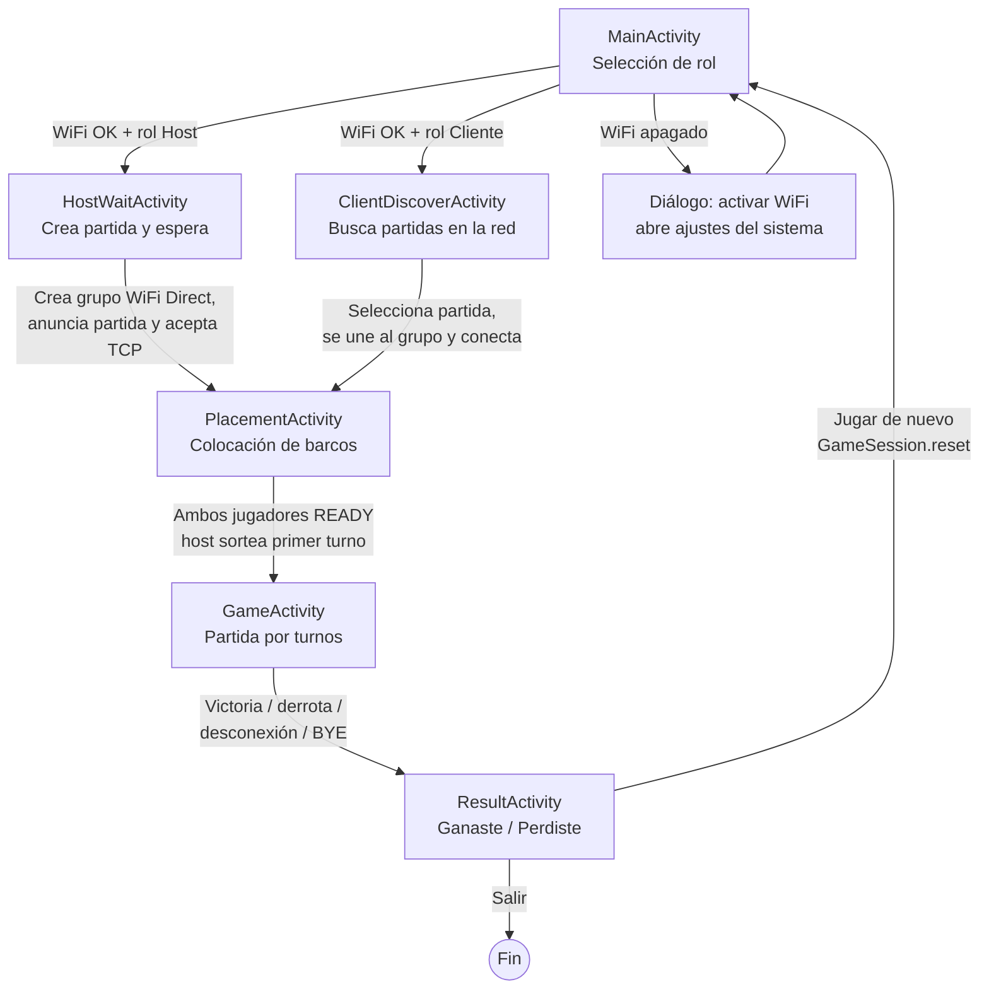
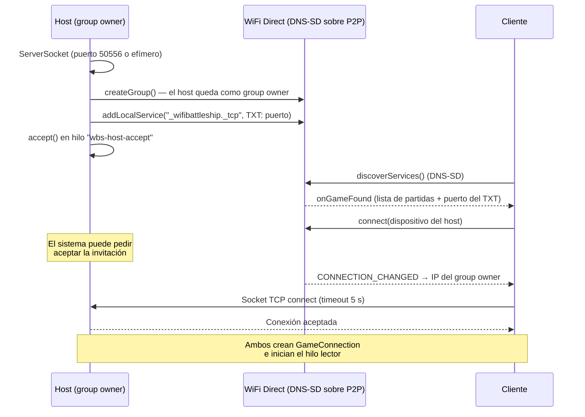
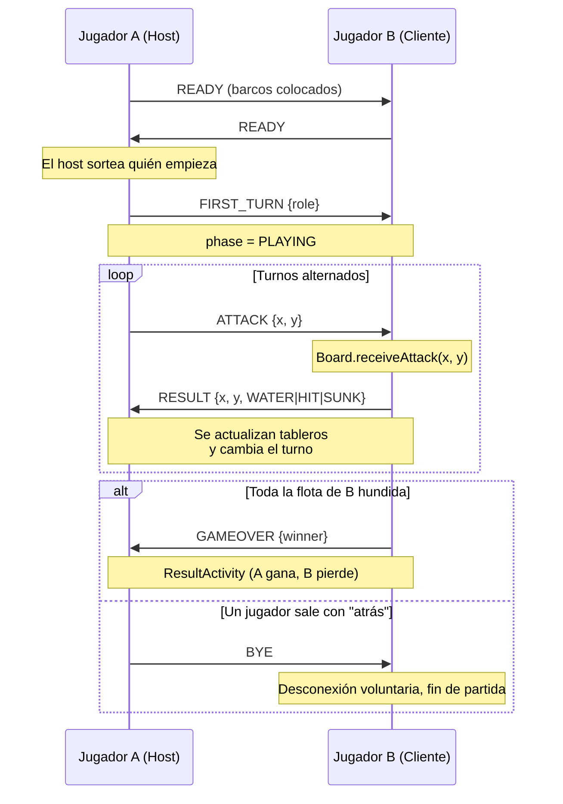
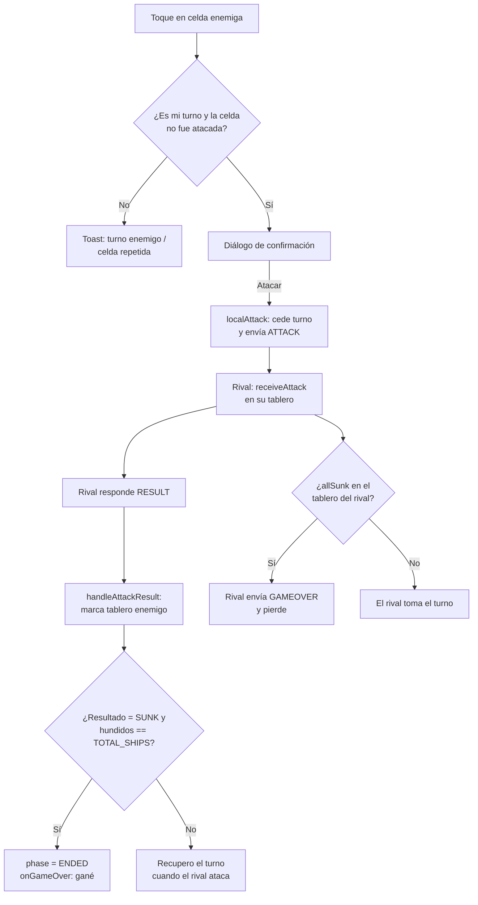
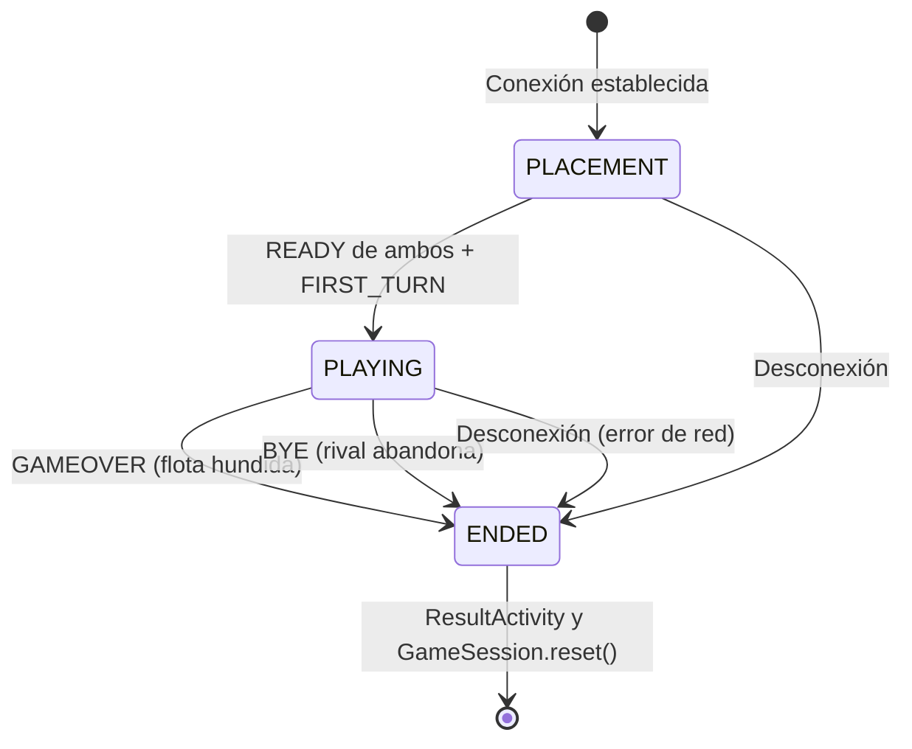

# Diagrama de flujo del software

Diagramas en formato **Mermaid** (se renderizan en GitHub, VS Code y Android Studio con plugin).

## 1. Flujo general de pantallas

## 2. Establecimiento de la conexión (Host vs Cliente)

## 3. Desarrollo de la partida (protocolo de mensajes)

## 4. Lógica de un ataque dentro de `GameController`

## 5. Estados de la partida

